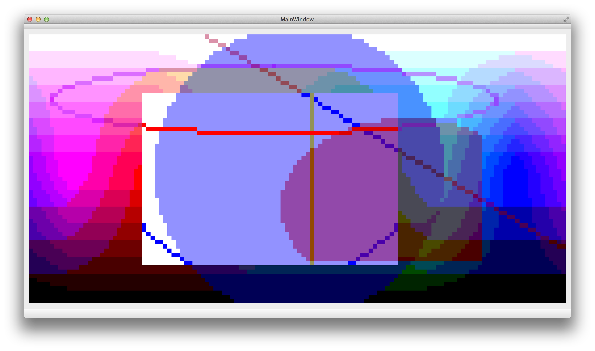

# µ-painter: embedded graphics and event system

This is a playground to figure out how to do a 2D graphics and event system (GES) on µ-controllers in a schmart™ way, i.e. fast on ARMs and yet efficient on AVRs.

This will focus on **all** layers of the graphics and event system process:

- memory access: either direct with FSMC, or (double-)buffered
- memory format: color depts, axis swapping, bit mappings
- acceleration: typical memory access operations optimized for format, like DMA2D support, fast line rendering
- renderers: using software renderer or external graphics card like FT8XX
- graphics context: transformations, context savings, etc.
- graphics api: with a small subset of SVG 2d api for resolution independence
- event system: something roughly similar to [MicroUI from ESR]() but in C++

A full fledged GUI is not part of this playground, i.e. only GES, no Base Window System, no Window Manager, no UI Toolkit. Maybe later.

Have fun.

#### Implementation status

- [x] C++14
- [x] Pixel formats and colors:
	- [x] many pixel formats with respective alpha formats. See [Surfaces](doc/surface/README.md) for renderings.
	- [x] all operations from Porter and Duff's "Compositing Digital Images" implemented for all colors.
	- [x] `constexpr` pixel color constants for compile-time casting to native color.
	- [x] HTML 3.2 color constants.
- [x] Pixel Buffer wrapper class.
- [x] Surface class for applying pixel operations.
- [ ] Geometry:
	- [x] classes for Point, Line, Size, Rectangle, Circle, Ellipse.
	- [x] collision detection for combinations (some complex cases still missing).
	- [ ] unit tests for geometry classes.
- [x] Math:
	- [x] generic, `constexpr` and precision aware `fixed_point_t` class.
	- [x] extensive unit tests for `fixed_point_t`.
- [ ] Renderer:
	- [x] primitive rendering and filling.
		- [x] Line.
		- [x] Rect.
		- [x] Circle.
		- [x] Ellipse.
	- [x] rectangular clipping **not** using guard band clipping (where possible).
	- [ ] anti-aliased rendering.
	- [ ] rendering unit tests.
- [x] Simulation in Qt:
	- [x] rendering into QImage with basic viewer.
	- [x] native Qt project compiles with Qt 5.5 and statically linked xpcc library.
- [x] working unit test harness from xpcc
- [ ] benchmarks of rendering
- [ ] optimization rendering

Example rendering in simulator showing `RGB332` color format with clipped primitives:

