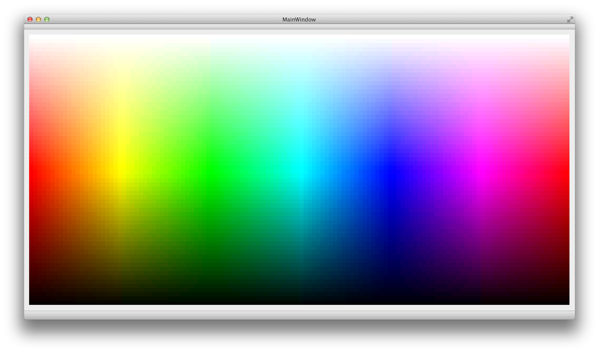
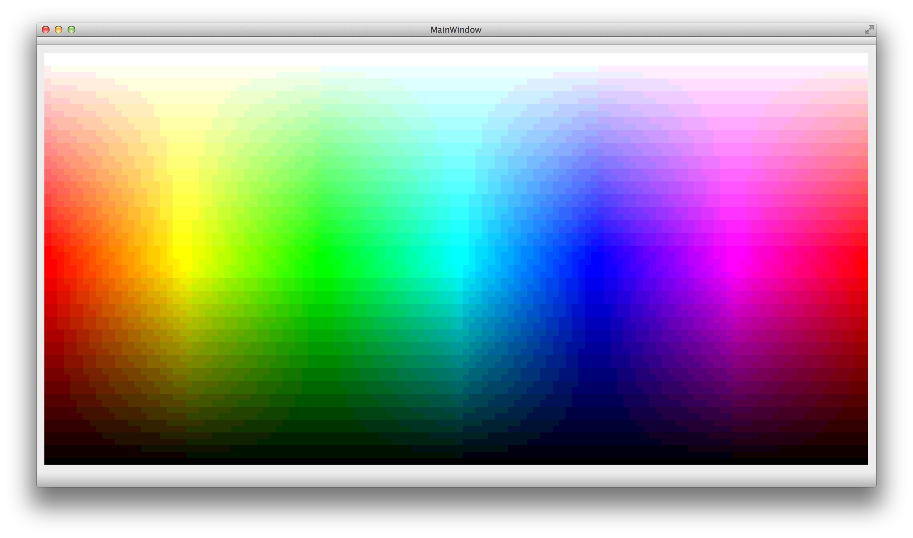
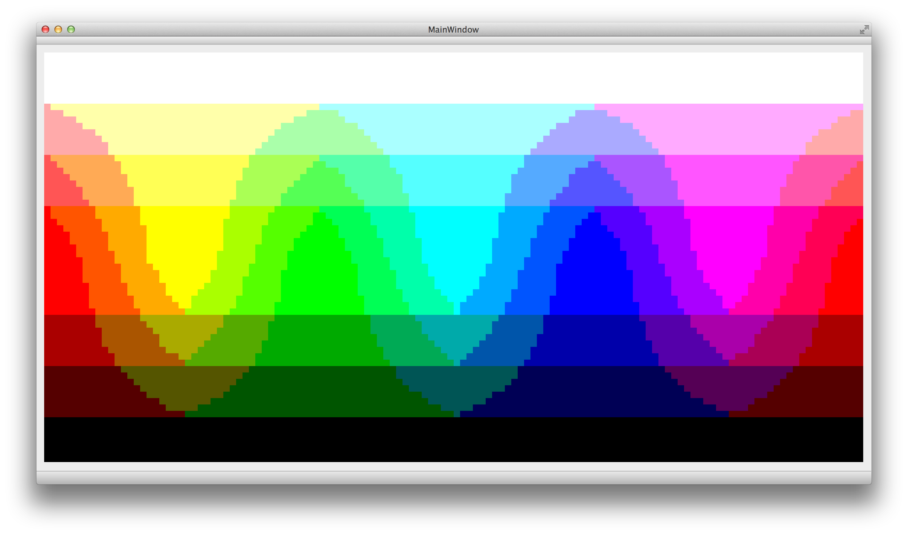
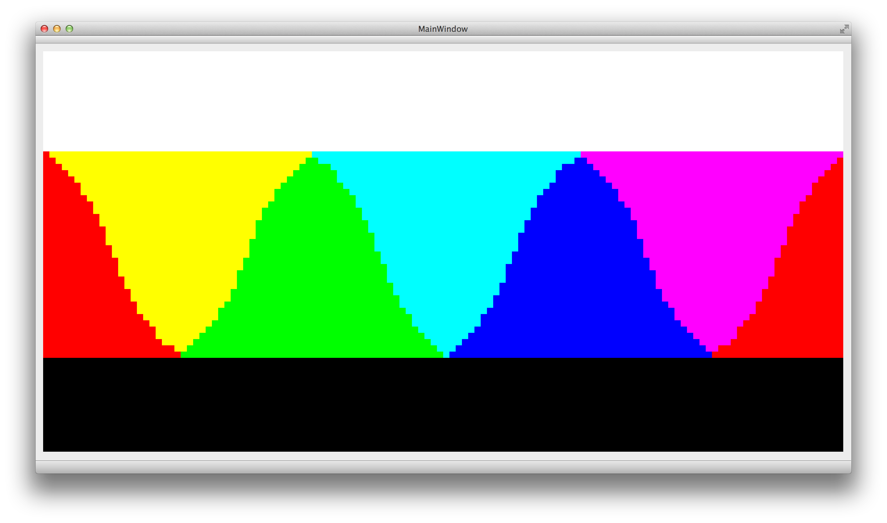
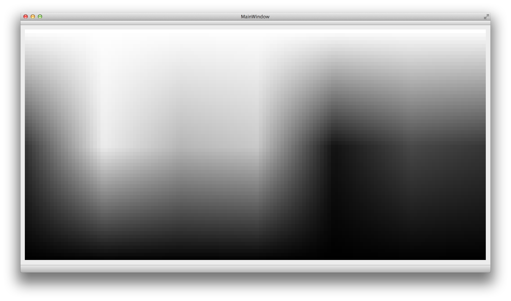
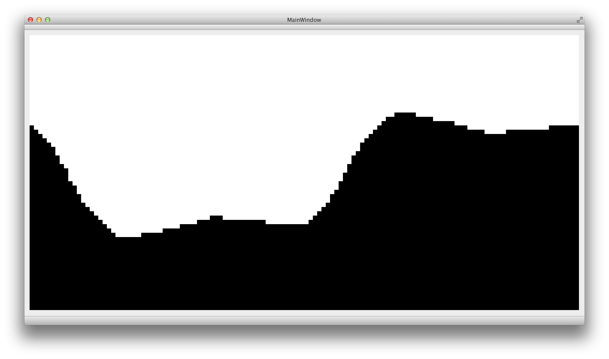

# Surfaces

now with guaranteed less than 100% color!

Here are some test pictures demonstrating several color depths as rendered on a 128x64 display in Qt using  QImage.
No dithering was used, though.

The colors are a rendering of the [HSL](https://en.wikipedia.org/wiki/HSL_and_HSV) color space.
Wikipedia also has a [list of monochrome and RGB palettes](https://en.wikipedia.org/wiki/List_of_monochrome_and_RGB_palettes).

### 24bpp ARGB8

This is what you have on you computer. 8bit for every color and for alpha channel.

### 16bpp RGB565

Compact form used for most displays that are driveable by a µC. FT8XX tops out with this.
Almost as "good" as ARGB8.
Green has 6bit, because eye has higher sensitivity for it.

### 15bpp ARGB1555

Same as RGB565, but green only has 5bit and one bit alpha channel.

### 12bpp ARGB4

4 bit for every color and alpha. Not so great anymore.

### 8bpp RGB332

3bit for red and green, only 2 for blue because eye is the least sensitive for blue.
This looks terrible, but the upshot is that its only one byte per pixel.

### 6bpp ARGB2

2bit for every color and alpha. Better start running.

### 3bpp RGB1

ROFLOL. 1bit for every color. GET TO THE CHOPPER!

### 8bpp Grayscale

8bits per pixel, but grayscale!
This uses the following formula to map colors onto their perceived brightness:

Luminence: (0.2125 * red) + (0.7154 * green) + (0.0721 * blue)

### 1bpp Grayscale

Lolnope. Needs dithering. NOW!

